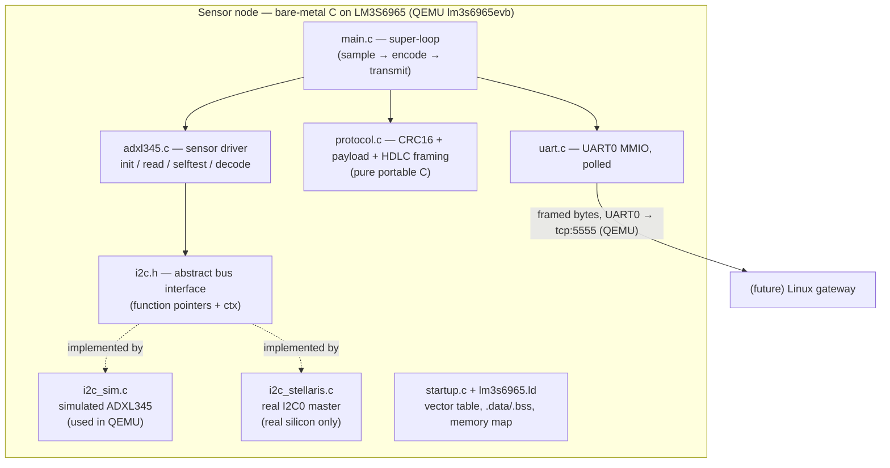

# Sharak — Architecture

This document describes the system in two parts. Sections 1–8 cover the
**delivered** layers: the bare-metal sensor node, the portable protocol, and
the build/CI spine. Section 9 covers the **gateway** layer, which is in
development. The kernel driver, MQTT, and analytics layers are on the roadmap
(see `../process/PLAN.md`).

---

## 1. Layering



Dependency rule: arrows only point downward/outward. `protocol.c` and
`adxl345_decode()` depend on **nothing** (not even the bus), which is exactly
what makes them host-testable.

## 2. The key design decision: I2C dependency injection

QEMU's `lm3s6965evb` machine emulates the Cortex-M3 core, flash/SRAM and
UART0 — but **not** the I2C peripheral. Writing to I2C0 registers in QEMU
does nothing useful, so a driver hard-wired to MMIO could never be exercised
in emulation.

Therefore the ADXL345 driver never touches a bus directly. It receives a
`const i2c_bus_t *`:

```c
typedef struct i2c_bus {
    int (*write)(void *ctx, uint8_t addr7, const uint8_t *buf, size_t len);
    int (*write_read)(void *ctx, uint8_t addr7,
                      const uint8_t *wbuf, size_t wlen,
                      uint8_t *rbuf, size_t rlen);
    void *ctx;
} i2c_bus_t;
```

Two backends implement it:

| Backend | Where it runs | What it is |
|---|---|---|
| `i2c_sim.c` | QEMU + host unit tests | A fake ADXL345: RAM register file, DEVID = 0xE5, honors POWER_CTL/DATA_FORMAT, serves a deterministic synthetic vibration signal on burst reads |
| `i2c_stellaris.c` | real LM3S6965 silicon | I2C0 single-master via I2CMSA/I2CMCS/I2CMDR per the datasheet — compiled in every build so it can't rot, but not selected in QEMU |

The driver cannot tell them apart. The same `adxl345_init/read` code that the
unit tests exercise against the sim is the code that would talk to the real
chip — which is the entire point of dependency injection here: **the QEMU
limitation is contained in one swappable backend instead of leaking into the
driver.**

## 3. Data flow, end to end

```
ADXL345 (sim or real)
  │  6 raw bytes, one burst read from reg 0x32 (torn-sample safe)
  ▼
adxl345_decode()                    raw LE int16 ──> int32 milli-g (×125/32)
  ▼
sk_payload_pack()                   16-byte payload (ver|type|seq|x|y|z, LE)
  ▼
sk_frame_encode()                   + CRC-16/CCITT-FALSE (big-endian)
  │                                 + HDLC byte stuffing + 0x7E flags
  ▼
uart_write()                        polled MMIO, UART0
  ▼
QEMU -serial tcp:127.0.0.1:5555     (the future gateway reads here)
```

## 4. Wire format

### Envelope (4 bytes, every message)

| Offset | Size | Field | Encoding |
|-------:|-----:|-------|----------|
| 0 | 1 | `ver`  | `0x01` |
| 1 | 1 | `type` | message type — selects the body below |
| 2 | 2 | `seq`  | uint16, little-endian, wraps |

### Type-specific bodies

| `type` | Sensor | Body | Payload total |
|---|---|---|---|
| `0x01` | Accelerometer (vibration) | `x_mg`, `y_mg`, `z_mg` — int32 LE | 16 bytes |
| `0x02` | Temperature | `temp_centi_c` — int16 LE (centi-°C) | 6 bytes |
| `0x03` | Current / load | `current_ma` — int32 LE (milli-amps) | 8 bytes |

The payload is therefore **variable length, type-tagged**. The frame's HDLC
flags already delimit it, so no explicit length field is needed on the wire —
the receiver derives the payload length from the frame and dispatches on `type`.
A fixed-size payload would only waste bytes on the smaller message types and
still require the same `type` switch.

Adding a sensor type adds a row here; it changes neither the envelope nor any
existing type's contract. Transport and FrameParser stay payload-agnostic and
are therefore sensor-agnostic.

### Frame

```
0x7E  [ stuffed( payload[16] + crc_hi + crc_lo ) ]  0x7E
```

- CRC-16/CCITT-FALSE (poly 0x1021, init 0xFFFF, no reflection, xorout 0)
  over the 16 payload bytes, appended **big-endian** — note this is the one
  big-endian item on an otherwise little-endian wire; it makes the standard
  "CRC over payload+crc equals 0x0000" residue check work directly.
- Stuffing: `0x7E → 0x7D 0x5E`, `0x7D → 0x7D 0x5D` (i.e. `0x7D, b ^ 0x20`).
- Worst case every inner byte is stuffed: 2×18 + 2 flags = **38 bytes max**.
- The decoder is a byte-at-a-time state machine, so a receiver on a stream
  (which sees arbitrary chunk boundaries) can reuse it verbatim, and can
  resynchronize on the next `0x7E` after any corruption.

## 5. Memory & runtime model

- **No heap anywhere.** All buffers are static or stack; the image links with
  `-nostdlib`. Worst-case memory use is knowable at link time (see the
  generated `.map`).
- **No interrupts (yet).** TX is polled, the loop is a super-loop with a
  crude busy-wait pacing ~100 Hz nominal. This is a deliberate simplicity for
  the current node; a SysTick-driven scheduler is a planned refinement.
- **Startup is ours**: vector table (initial SP + Reset_Handler), `.data`
  copy from flash, `.bss` zero-fill — visible in `startup.c` instead of
  hidden in a vendor CRT.

## 6. Sensor configuration (ADXL345, datasheet Rev. G)

| Register | Value | Why |
|---|---|---|
| DEVID (0x00) | reads 0xE5 | identity check before any configuration |
| DATA_FORMAT (0x31) | 0x0B = FULL_RES \| ±16 g | FULL_RES keeps a constant 3.90625 mg/LSB (256 LSB/g) on every range |
| BW_RATE (0x2C) | 0x0A | 100 Hz output data rate (rate-code table, datasheet) |
| POWER_CTL (0x2D) | 0x08 | Measure bit (D3) — leave standby *after* configuration |

Scaling: `mg = raw × 1000 / 256 = raw × 125 / 32` — multiply first (G-1),
integer-only (G-2), sign via `(int32_t)(int16_t)` (G-7).

## 7. Build & test strategy

Two compilers, one source tree:

- `arm-none-eabi-gcc` builds the whole node image (including the sim backend,
  which is what `main.c` wires up under QEMU).
- plain `gcc` builds the portable subset (`protocol.c`, `adxl345.c` decode +
  driver logic, `i2c_sim.c`) together with `tests/test_*.c` so all logic runs
  natively under a debugger, with `-Wall -Wextra -Werror`.

CI (`.github/workflows/ci.yml`) does both on every push; any test failure or
warning fails the build.

## 8. Decisions log

| Decision | Alternatives considered | Why this one |
|---|---|---|
| DI via function-pointer struct | `#ifdef QEMU_BUILD` compile-time switch | ifdefs would leave the real backend never-compiled and untestable; DI keeps both compiled and lets unit tests inject failures |
| CRC big-endian on wire | little-endian (rest of wire) | standard residue property: CRC(payload‖crc) == 0 with no byte swapping |
| Bitwise CRC (no table) | 256-entry lookup table | table costs 512 B flash for speed we don't need at 100 Hz × 38 B |
| Byte-stuffed flags (HDLC) | length-prefixed frames | self-resynchronizing after corruption; length prefixes desync permanently on a corrupted length byte |
| Sim backend in firmware image | host-only sim | QEMU must run the *same* driver path as hardware; the sim is the node's "sensor" under emulation |
| Polled UART | IRQ + ring buffer | node-side simplicity; 38 B at 100 Hz is far below UART throughput, so polling provably cannot fall behind |

## 9. Gateway architecture (C++17, Linux)

The gateway is the Linux-side counterpart to the node: it ingests framed
telemetry from a **fleet** of nodes, validates it, stores it, and exposes it.
It is structured the same way the node is — as decoupled layers behind stable
contracts — so each stage can evolve or be replaced independently.

### 9.1 The wire contract is the firewall

The node and the gateway share exactly one thing: the frozen wire format of
Section 4. Neither side knows anything else about the other. This is the
single most important boundary in the system: the node firmware can be rewritten
(FreeRTOS, real STM32 silicon, a different sensor) and the gateway is unaffected
as long as the bytes on the wire still parse. Conversely, the gateway can be
rebuilt freely because it depends only on those bytes.

To make that guarantee mechanical rather than aspirational, the gateway **reuses
the same `protocol.c`** the firmware uses, linked into C++ through an
`extern "C"` seam. There is no second, hand-ported decoder to drift out of sync —
the two ends are byte-identical by construction.

### 9.2 Internal layering (dependency inversion)

```mermaid
flowchart TB
    subgraph GW["Gateway — C++17 on Linux"]
        T["Transport<br/>per-node byte stream (serial / TCP)"]
        FP["FrameParser<br/>streaming HDLC reassembly → payload"]
        DEC["Decode + verify<br/>extern \"C\" → protocol.c"]
        ST["Store<br/>interface → SQLite backend"]
        EX["Exposure<br/>query CLI · (stub) MQTT/cloud"]
    end
    T --> FP --> DEC --> ST --> EX
```

Dependencies point one way down the chain, and each stage depends on an
**interface**, not a concrete type. The parser does not know whether bytes came
from a real serial port or a socket; the ingest path does not know whether the
store is SQLite, an in-memory fake (for tests), or a future time-series database;
the exposure layer hides whether telemetry leaves over a CLI query or a cloud
publisher. The cloud/MQTT path is stubbed behind its interface so the seam
exists before the implementation does.

### 9.3 Multi-node identity comes from the transport

The payload deliberately carries **no node-ID field** (Section 4). When the
gateway aggregates a fleet, each node's identity is therefore derived from the
**transport** — which connection or serial endpoint a frame arrived on — not from
the bytes inside the frame. This keeps the wire format minimal and pushes the
fleet-management concern entirely into the gateway, where it belongs.

This is the reason the gateway is exercised against **multiple** simulated nodes
rather than one: handling N concurrent sources (multiplexing connections,
attributing readings, per-node statistics) is a first-class gateway
responsibility, not an afterthought.

### 9.4 Fleet simulation

The nodes that feed the gateway during development are simulators that **encode
through the very same `protocol.c`**. Because they use the production encoder,
their output is byte-exact with what real firmware emits, and they exercise the
same `extern "C"` linkage seam the gateway relies on. The simulators are
development scaffolding for the gateway, not a product layer — they exist to put
a realistic, multi-source load in front of the code under test.

### 9.5 Gateway decisions log

| Decision | Alternatives considered | Why this one |
|---|---|---|
| Reuse `protocol.c` via `extern "C"` | re-implement the decoder in C++ | one source of truth for the wire format; a second decoder would inevitably drift |
| Node identity from transport | add a node-ID field to the payload | keeps the frozen wire format minimal; fleet identity is a gateway concern, not a node concern |
| Interface per stage (transport/store/exposure) | direct concrete calls | lets tests inject fakes and lets backends (SQLite, MQTT, cloud) change without touching ingest |
| Streaming byte-at-a-time parser | read whole frames then parse | a stream delivers arbitrary chunk boundaries; a state machine consumes them and resynchronizes after corruption |
| Simulators encode via `protocol.c` | bespoke test-byte generators | byte-exact fidelity with real firmware and free coverage of the linkage seam |

---

## 10. Roadmap tiers (planned — cloud & edge AI)

SHARAK is a three-tier system. Tiers 1 (node) and 2 (gateway) are the delivered
and in-progress work above; tier 3 is captured here as **planned** so the system's
intended shape is explicit. Both roadmap features slot into the existing
dependency-inverted design without disturbing it — each is a new consumer behind
an interface, not a rewrite.

### 10.1 Cloud dashboard

The gateway's Exposure layer already defines the cloud seam (an MQTT/cloud
publisher behind its interface, currently stubbed). The planned tier 3 fills that
seam: the gateway publishes validated telemetry over **MQTT** to a broker, a
time-series store (e.g. InfluxDB) retains it, and a **Grafana** dashboard shows the
whole factory floor. No node or protocol change is required — it is purely an
additional Exposure backend.

### 10.2 Edge AI (on the gateway)

Condition monitoring has latency-critical decisions — a bearing failure or a robot
fault must be caught in milliseconds, not after a cloud round-trip. The planned
**Edge-AI stage** runs a lightweight inference model **on the gateway itself**,
directly after Decode: it consumes the live telemetry stream, flags anomalies, and
triggers a local response (alert / safe-state) without leaving the edge. It is a
new stage behind an interface, exactly like Store and Exposure — so it composes
into the existing pipeline (`Decode → [Analyzer] → Store → Exposure`) rather than
replacing anything.

Hardware path (future): the gateway runs on a real Linux SBC (e.g. Raspberry Pi)
executing the same C++ code plus a TFLite/ONNX model. **On-node TinyML** (inference
on the microcontroller itself) is a separate, deeper track that needs a
Cortex-M4/M7 target — tracked outside this project.

### 10.3 What stays out of scope (near term)

The three-tier vision is the *plan*; the near-term deliverable is tiers 1–2 (node +
gateway MVP), with cloud and edge AI shown honestly as future work. This keeps the
build focused on the C++/Linux systems-programming core that the project is really
about.
