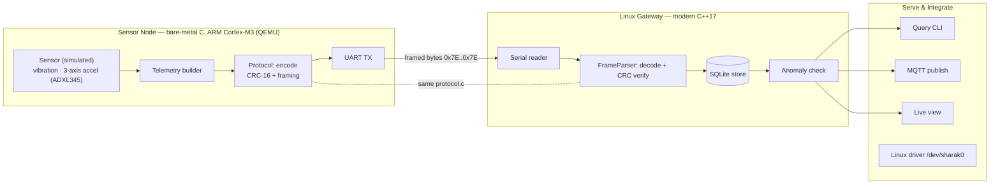
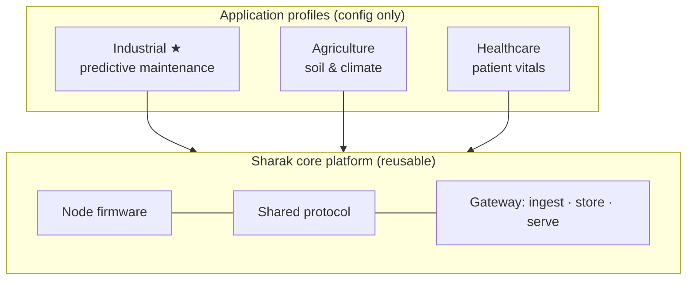

# Sharak — System Diagrams

These diagrams render automatically on GitHub. For a polished one-page visual,
open [`diagram.html`](diagram.html) in a browser.

> The orange/“shared protocol” box is the single `protocol.c` compiled into
> **both** the node firmware and the Linux gateway — so the two ends can never
> disagree on the wire format.

---

## 1. System architecture



---

## 2. How one reading travels (sequence)

```mermaid
sequenceDiagram
    participant Sensor
    participant FW as Node firmware
    participant Link as Serial link
    participant GW as Gateway
    participant DB as SQLite

    Sensor->>FW: raw reading
    FW->>FW: build telemetry + status flags
    FW->>FW: encode (CRC-16 + byte-stuffing)
    FW->>Link: framed bytes (0x7E .. 0x7E)
    Link->>GW: byte stream (may be split / noisy)
    GW->>GW: FrameParser reassembles a full frame
    GW->>GW: verify CRC + decode
    GW->>DB: store reading
    GW-->>GW: raise alert if over threshold
```

---

## 3. Platform layering — one core, many applications



The applications differ only in *what the channels mean* and *what thresholds
apply* — the firmware, protocol, and gateway code stay the same.
